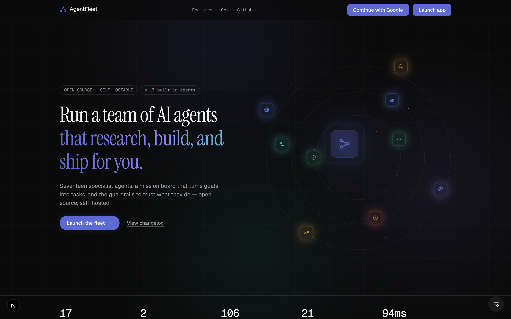
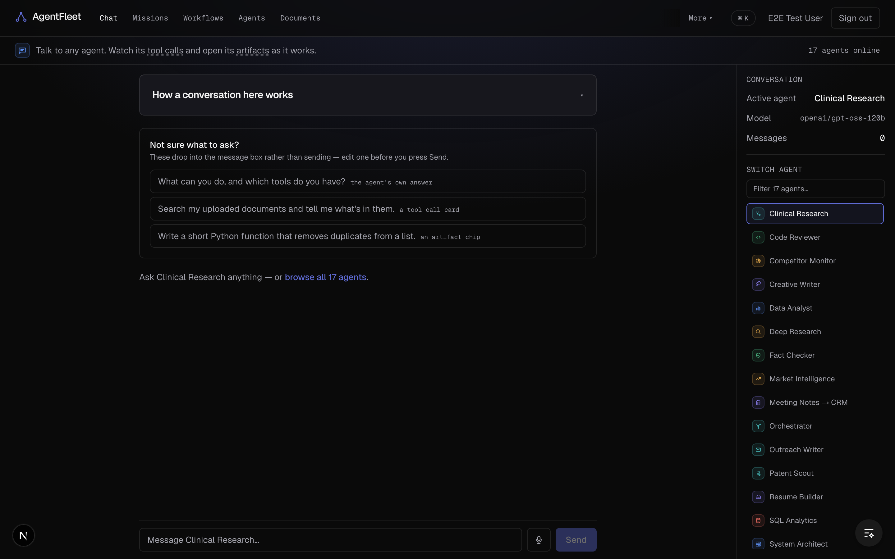
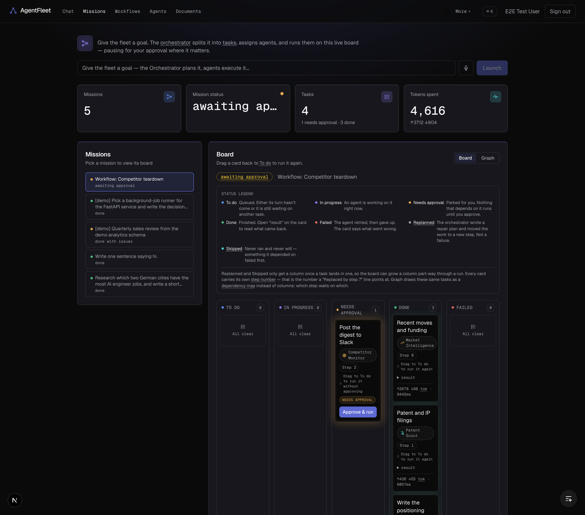
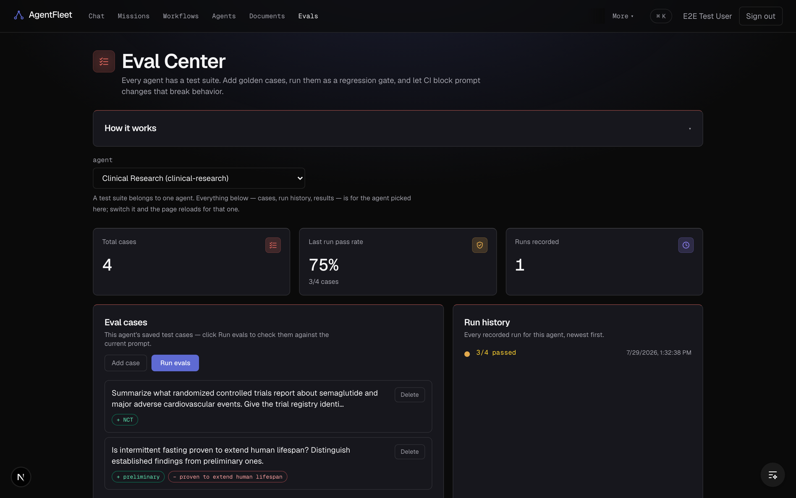
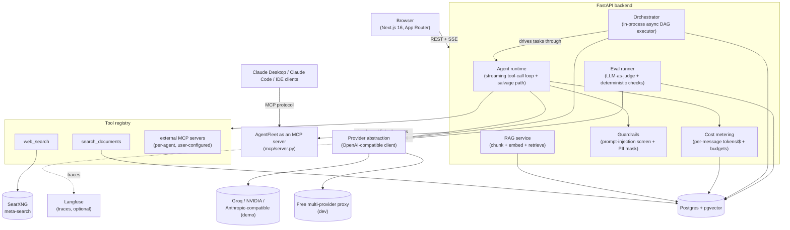

# AgentFleet

**A self-hostable multi-agent operations platform** — chat with a fleet of tool-using agents, hand the orchestrator a goal and watch it execute as a live task DAG, and run the whole thing with production-grade evals, cost governance, and guardrails.


## What it is

AgentFleet is a self-hostable multi-agent operations platform: chat with a roster of tool-using agents, hand the orchestrator a goal and watch it decompose into a live task DAG with human-approval gates, and manage the fleet — publishing, versioning, cost budgets, red-teaming, and CI-gated evals — from one dashboard. Every call is metered, traced, and guarded by design, not bolted on after the fact.

## Screenshots

| | |
|---|---|
|  **Landing** — pillars + ops layer overview |  **Chat** — streaming multi-agent chat with live tool-call cards |
|  **Missions** — Kanban DAG execution with a human-approval gate |  **Evals** — LLM-as-judge scoring + CI regression gate |

*(captured from a running instance — reproduce them with the [demo script](docs/DEMO.md))*

## Architecture



Full trade-off records (context → decision → why → what we gave up) live in [ARCHITECTURE.md](ARCHITECTURE.md).

## Features

| Pillar | What it does |
|---|---|
| Multi-agent chat | Streaming chat with a roster of specialized agents, each with its own tools, model, and system prompt |
| Tool-using agents | Hand-built agentic tool loop — streaming + tool calls + a salvage path for providers that abort mid-stream on a malformed call |
| Document intelligence | Upload text/PDFs → chunked, embedded locally (fastembed), retrieved with citations via pgvector |
| Orchestration | Hand the orchestrator a goal; an in-process async DAG executor plans it into parallel agent tasks with human-approval gates |
| Runtime agent builder | Build, publish (share URL / REST / MCP tool), version, and roll back agents without redeploying |
| Agent interop (MCP) | Consumes external MCP servers as tools **and** exposes the whole fleet as an MCP server for Claude/IDE clients |
| Ops layer | Eval Center, cost budgets, guardrails, red-team suite, versioned rollback — see below |

## The ops layer (what makes it different)

Most agent demos stop at "it can call a tool." AgentFleet treats an agent like a production service: every reply is metered for tokens/cost/latency and checked against per-agent and global budget caps; the Eval Center runs deterministic checks plus an LLM-as-judge over golden cases and a red-team suite (prompt-injection, jailbreak, secret-exfiltration attempts) — the deterministic checks run in CI on every push, while the LLM-judged eval currently runs only when a provider key is present and is **not yet blocking** (`.github/workflows/evals.yml`); every tool result is scanned for injected instructions before it reaches the model; and every agent config change can be published as a version and rolled back with one click. The story isn't "an agent that works" — it's "an agent fleet you could actually run."

## Tech stack

**Backend** — Python 3.12 · FastAPI (async) · Pydantic v2 · SQLAlchemy 2 (async) · Alembic · PostgreSQL + pgvector

**LLM & agents** — OpenAI-compatible client against a pluggable provider (free multi-provider proxy for dev; Groq / NVIDIA / Anthropic-compatible via env) · in-house tiered planner/executor model routing · LangGraph StateGraph agent runtime (model↔tools, conditional edges, checkpointing) — with a hand-built streaming loop as an env-switchable fallback · fastembed (local, CPU, BAAI/bge-small) for embeddings · custom in-process async DAG executor for orchestration (plan → task graph → parallel execution → human-in-the-loop approvals) · MCP in both directions

**Observability & ops** — Langfuse tracing (optional, env-gated) · per-message token/cost/latency metering · Eval Center (LLM-as-judge + deterministic checks) with a GitHub Actions regression gate · per-agent + global cost budgets with hard caps · guardrails (prompt-injection screening + PII masking) + red-team suite · versioned agent publishing with one-click rollback

**Frontend** — Next.js 16 (App Router, Turbopack) · TypeScript · Tailwind v4 (hand-rolled dark design system) · Auth.js v5 (Google OAuth)

**Infra** — Docker + one-command Docker Compose · Kubernetes manifests ([k8s/](k8s/README.md)) · GitHub Actions CI (tests against a live pgvector service) · **184 API tests + 26 Playwright E2E**, plus lint and typecheck gates

## Quick start (local)

**One command, full stack** (api + web + postgres + redis + searxng, all in Docker):

```bash
cp .env.example .env          # fill in your keys
docker compose -f docker/compose.full.yaml up --build
# open http://localhost:3002
```

A one-shot `migrate` service applies migrations, and `api`/`worker` wait on it via
`service_completed_successfully` — deliberately, so that with more than one replica
they never race `alembic upgrade head`. The api container then seeds the built-in
agent roster on boot (idempotent). See the header of
[`apps/api/docker-entrypoint.sh`](apps/api/docker-entrypoint.sh) for why migrations
are *not* in the entrypoint.

**Dev mode** (infra in Docker, api/web run locally with hot reload):

```bash
cp .env.example .env          # fill in your keys
docker compose -f docker/compose.yaml up -d
cd apps/api && uv sync && uv run uvicorn app.main:app --reload
cd apps/web && npm install && npm run dev
# open http://localhost:3002
```

Both paths serve the web app on **3002** (3000 is taken on this machine). If you
move that port, the Google OAuth callback URI has to move with it — register
`http://localhost:<port>/api/auth/callback/google` in the Google console, or
sign-in fails with `redirect_uri_mismatch`. `CORS_ORIGINS` in
`apps/api/app/config.py` already lists both 3002 and 3010 so the API keeps
answering either way.

K8s manifests for a local kind/k3d/minikube cluster live in [k8s/](k8s/README.md).

Deploying publicly on free tiers — Neon (Postgres + pgvector), Hugging Face Spaces
(API), Vercel (web) — is covered step by step in [docs/DEPLOY.md](docs/DEPLOY.md),
including why the API needs a 16GB host: it measures ~205MB imported and ~507MB
once the embedding model is resident, which does not fit a 256MB or 512MB free tier.

Want to see it running before you set it up? Follow the [demo script](docs/DEMO.md).

## Model routing

All LLM calls go through one OpenAI-compatible provider abstraction (ADR-005 in [ARCHITECTURE.md](ARCHITECTURE.md)). Dev work rides a free multi-provider proxy — Groq's `gpt-oss-120b` by default, with an 11-provider quota cascade — so iterating costs nothing; pointing `FREE_LLM_BASE_URL`/`FREE_LLM_KEY` at a paid endpoint switches demos to a stronger model with zero code changes. On top of that, the Orchestrator's planning call can use a separate, stronger `PLANNER_MODEL` while per-task execution stays on the cheap default — a tiered planner/executor split that keeps spend proportional to how much a call actually matters, with every call metered either way.

## Roadmap

> **Picking up work with no context?** [`docs/ROADMAP.md`](docs/ROADMAP.md) is the
> self-contained handoff: what is next and why, the exact bugs with file and line,
> the verification commands, and — importantly — **which checks a given environment
> can actually run**. The test suite needs a live Postgres, so a cloud VM without
> Docker cannot run it; that is a missing dependency, not a regression.

**Shipped:**
- [x] P1 Foundation — repo, compose stack, schema, auth, design tokens
- [x] P2 + P2b — agent runtime, streaming chat, tools (web search, tool-call cards, agentic-loop salvage)
- [x] LangGraph agent runtime (ADR-001) — StateGraph model↔tools loop with checkpointing, now the default; hand-built loop kept as an `AGENT_RUNTIME=native` fallback
- [x] P4 — document RAG + deep research (local pgvector embeddings)
- [x] P5 — DAG orchestration + Kanban + HITL approvals
- [x] P6 — agent builder + publish (share/API/MCP) + templates + external MCP
- [x] P7 — ops layer: Eval Center + CI gate, cost budgets, guardrails + red-team, versioned rollback
- [x] Local prod packaging — one-command Docker Compose + Kubernetes manifests
- [x] Landing page + design polish

**Next:**
- [ ] P8 — extra roster agents beyond the built-in set
- [x] Redis/arq durable task execution (ADR-004) — `ORCHESTRATOR_MODE=arq` enqueues to
      the worker; verified by killing the API mid-run and watching the run complete
- [ ] Cloud deploy — GCP (Cloud Run + Terraform + Workload Identity Federation), with
      the manifests in [k8s/](k8s/README.md) validated on a kind cluster in CI

**Intentionally not wired yet** (see [ARCHITECTURE.md](ARCHITECTURE.md) for the full trade-offs):
- Temporal as the longer-term durable-execution answer, noted in ADR-004 as the scale-up path
- Hybrid retrieval (sparse + dense with reranking) — retrieval is dense-only today; see ADR-002's dated status block
- OpenTelemetry GenAI tracing — see ADR-003's dated status block for what is and is not wired

## License

MIT — see [LICENSE](LICENSE).
